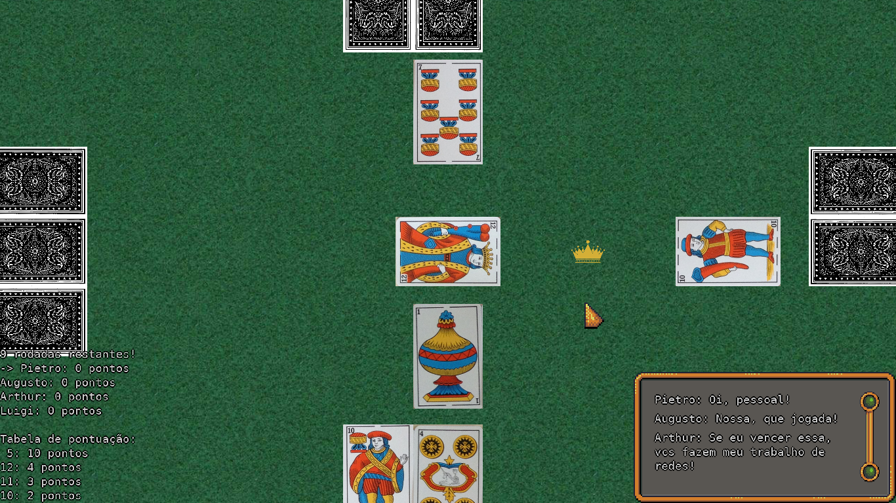

# BiscaNet

Jogo Da Bisca em MonoGame (Prime)

## Como Jogar

Na bisca, há sempre um coringa em jogo (é a carta no meio do campo). Cartas que tenham o mesmo naipe do coringa vencem sempre.

O jogo começa com o jogador que distribuiu as cartas (o hospedeiro), e segue em sentido anti-horário.

Em sua vez cada jogador desce uma de suas 3 cartas.

Quando todos tiverem descido suas cartas, o jogador que desceu a melhor carta recolhe-as e adiciona a soma de seus valores à seus pontos.

As cartas possuem valores como definidos na tabela:

| Número | Valor |
| --- | --- |
| 5 | 10 pontos |
| 12 | 4 pontos |
| 11 | 3 pontos |
| 10 | 2 pontos |
| Todos os outros | Nenhum ponto |

Para verificar qual das cartas jogadas é a melhor, faz-se a seguinte comparação:

1. Se foi jogado 1 carta com o naipe coringa, o jogador que a jogou vence
2. Se mais de um coringa foi jogado, comparam-se os coringas como no item 3
3. Vence a carta de maior valor (indicado na tabela acima)
4. Se nenhuma das cartas comparadas tem valor, vence a de maior número
5. Se o número ou o valor empatarem, vence quem jogou a primeira carta

Durante a sua vez, também é possível trocar o coringa. Se tiveres uma carta com o mesmo número do coringa, clique com o botão direito para adicionar o coringa em sua mão e definir o novo coringa.

Para baixar o jogo, acesse a página de [releases](https://github.com/PietroCarrara/BiscaNet/releases)
